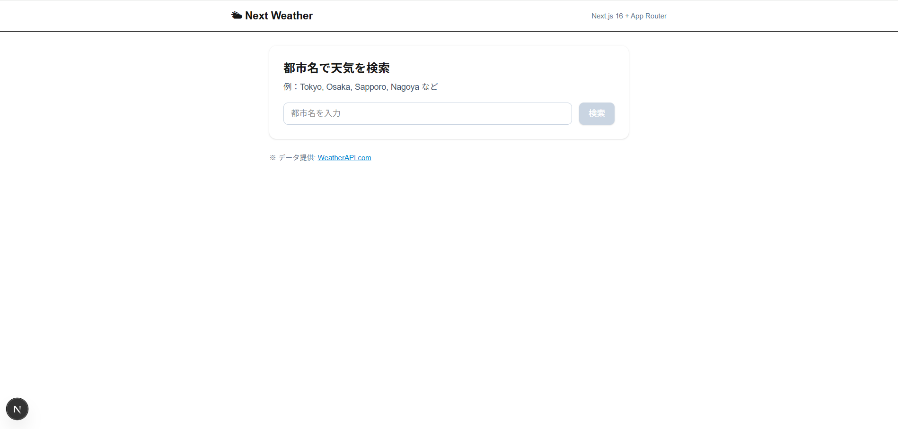
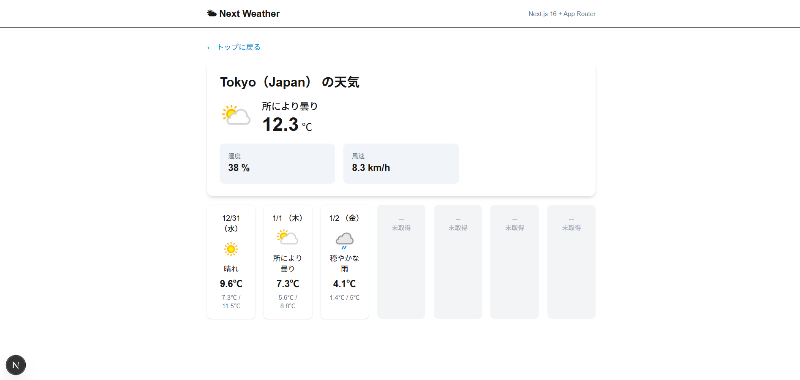

# 🌤️ Next Weather App

Next.js × TypeScript × Tailwind CSS を用いた  
**シンプルで使いやすい天気検索 Web アプリ**です。

都市名を入力すると、

- 今日の天気
- 週間天気（最大 7 日枠）

を表示します。

Next.js（App Router）を利用し、  
**SSR / Route Handler / エラーハンドリング**を実装しています。

---

## 📌 バージョン情報

- **v1.0.0**：今日の天気検索機能まで実装済み（完成版）
- **v1.1.0**：週間天気（7 日枠表示）を追加
- **v2.0.0**：検索履歴機能（最大 5 件・オートコンプリート・ピン固定・デフォルトアイコン・モバイル対応）を追加

---

## 📸 スクリーンショット

### 🔍 トップページ（検索フォーム）



---

### 🌦 天気詳細ページ（今日 & 週間天気）



---

## 🚀 使用技術

| 分類           | 技術                                                |
| -------------- | --------------------------------------------------- |
| フレームワーク | Next.js 16（App Router）                            |
| 言語           | TypeScript                                          |
| UI             | Tailwind CSS                                        |
| API            | WeatherAPI（外部 API）                              |
| サーバー処理   | Next.js Route Handler（`app/api/weather/route.ts`） |
| データ取得     | SSR（毎回最新の天気を取得）                         |
| ストレージ     | localStorage（検索履歴保管）                        |

---

## ✨ 主な機能

- 🔎 都市名による天気検索
- 🌤 今日の天気表示（気温・湿度・風速・天候アイコン）
- 📅 週間天気表示（最大 7 日分の枠）
- 🧭 動的ルーティング `/weather/[city]`
- 🔁 SSR による最新データ取得
- 📱 レスポンシブ対応（スマホ / PC）
- 💾 検索履歴の保存（最大 5 件）
- 🔍 オートコンプリート検索候補（履歴ベース）
- 📌 ピン固定機能（よく使う都市を常に先頭に表示）
- 🖼 天気アイコン未取得時はデフォルトアイコン表示

---

## 週間天気について（API 制限）

本アプリでは **WeatherAPI（フリープラン）**を利用しています。

フリープランでは  
**最大 3 日分まで**しか予報データを取得できません。

そのため本アプリでは以下の設計を採用しています。

- 表示枠は常に **7 日分**
- 取得できた日（最大 3 日分）：実データを表示
- 取得できない日（4〜7 日目）：「未取得」として表示

### この設計のメリット

- UI レイアウトが常に安定
- 将来、有料プランに切り替えても UI を変更せず拡張可能

---

## 🛠 エラーハンドリング

以下のケースで、分かりやすいエラー画面を表示します。

| ケース           | 表示内容                           |
| ---------------- | ---------------------------------- |
| 存在しない都市   | お探しの都市は見つかりませんでした |
| API キー未設定   | API キーが正しく設定されていません |
| ネットワーク障害 | 問題が発生しました                 |
| サーバーエラー   | error.tsx が発動                   |

Next.js の **error.tsx / loading.tsx** を活用し、  
「落ちないアプリ」を実現しています。

---

## 🏗️ ディレクトリ構造

```

app
├─ page.tsx
├─ layout.tsx
├─ weather
│ ├─ [city]
│ │ ├─ page.tsx
│ │ ├─ error.tsx
│ │ ├─ loading.tsx
│ │ └─ components
│ │ ├─ CurrentWeather.tsx
│ │ ├─ ForecastGrid.tsx
│ │ └─ ForecastCard.tsx
├─ api
│ └─ weather
│ └─ route.ts
public
└─ images
└─ default-weather.svg
images
├─ images.top.png
└─ images.weather.png

```

## 🔧 セットアップ

#### 1. リポジトリを clone

`git clone https://github.com/chiemi123/next-weather-app
cd weather-app`

#### 2. 依存パッケージのインストール

`npm install`

#### 🔑 API キーの設定

プロジェクト直下に .env.local を作成し、以下を追加します：

`WEATHER_API_KEY=あなたのAPIキー
NEXT_PUBLIC_BASE_URL=http://localhost:3000`

※ .env.local は Git リポジトリに含めないでください（自動で無視されます）

#### ▶ 開発サーバー起動

`npm run dev`

ブラウザで：

http://localhost:3000

へアクセス。

#### 🧪 テスト内容（実施済み）

- 正常系：Tokyo などの都市名で検索

- エラー系：存在しない都市の検索

- API URL 破壊テスト（500 エラー）

- Route Handler 強制エラー（throw new Error）

- ネットワーク断（機内モード）

- API キー削除時のハンドリング

- 検索履歴機能（履歴保存・オートコンプリート・ピン固定・削除）

すべて正常に動作を確認済みです。

#### 📝 今後の拡張予定

- 🔍 オートコンプリート検索

- 🗺 地図表示（Leaflet / Google Maps）

- 🎨 ダークモード対応

#### 👤 作者

- 名前：遠藤 千恵美

- GitHub：https://github.com/chiemi123/next-weather-app
